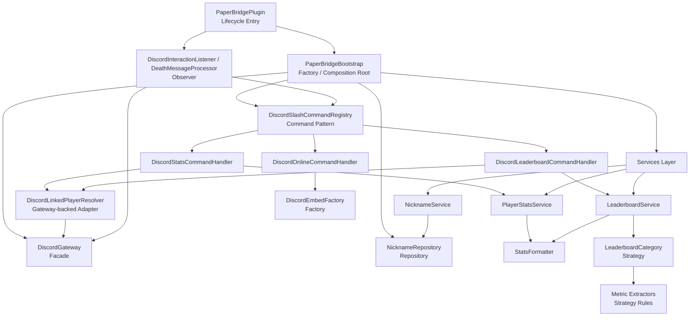
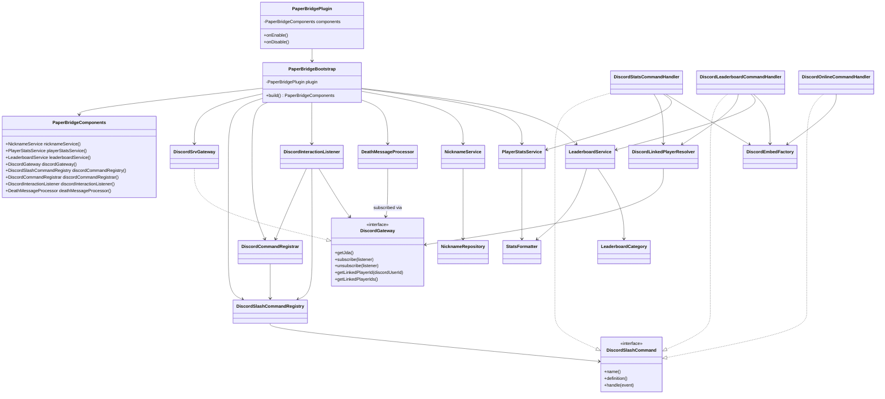

# PaperBridge Design Pattern Diagrams

## Design Pattern 路線架構圖

```mermaid
flowchart TD
    Plugin["PaperBridgePlugin\nLifecycle Entry"] --> Bootstrap["PaperBridgeBootstrap\nFactory / Composition Root"]
    Bootstrap --> Commands["DiscordSlashCommandRegistry\nCommand Pattern"]
    Bootstrap --> Gateway["DiscordGateway\nFacade"]
    Bootstrap --> Services["Services Layer"]
    Bootstrap --> Repo["NicknameRepository\nRepository"]

    Commands --> StatsCmd["DiscordStatsCommandHandler"]
    Commands --> LeaderboardCmd["DiscordLeaderboardCommandHandler"]
    Commands --> OnlineCmd["DiscordOnlineCommandHandler"]

    StatsCmd --> Resolver["DiscordLinkedPlayerResolver\nGateway-backed Adapter"]
    LeaderboardCmd --> Resolver
    StatsCmd --> PlayerStats["PlayerStatsService"]
    LeaderboardCmd --> Leaderboard["LeaderboardService"]
    OnlineCmd --> EmbedFactory["DiscordEmbedFactory\nFactory"]

    Resolver --> Gateway
    PlayerStats --> Formatter["StatsFormatter"]
    Leaderboard --> Formatter
    Leaderboard --> Category["LeaderboardCategory\nStrategy"]
    Category --> MetricRules["Metric Extractors\nStrategy Rules"]

    Plugin --> Integration["DiscordInteractionListener / DeathMessageProcessor\nObserver"]
    Integration --> Gateway
    Integration --> Commands

    Services --> PlayerStats
    Services --> Leaderboard
    Services --> Nickname["NicknameService"]
    Nickname --> Repo
```

## 類別圖

```mermaid
classDiagram
    class PaperBridgePlugin {
        -PaperBridgeComponents components
        +onEnable()
        +onDisable()
    }

    class PaperBridgeBootstrap {
        -PaperBridgePlugin plugin
        +build() PaperBridgeComponents
    }

    class PaperBridgeComponents {
        +NicknameService nicknameService()
        +PlayerStatsService playerStatsService()
        +LeaderboardService leaderboardService()
        +DiscordGateway discordGateway()
        +DiscordSlashCommandRegistry discordCommandRegistry()
        +DiscordCommandRegistrar discordCommandRegistrar()
        +DiscordInteractionListener discordInteractionListener()
        +DeathMessageProcessor deathMessageProcessor()
    }

    class DiscordGateway {
        <<interface>>
        +getJda()
        +subscribe(listener)
        +unsubscribe(listener)
        +getLinkedPlayerId(discordUserId)
        +getLinkedPlayerIds()
    }

    class DiscordSrvGateway
    class DiscordSlashCommand {
        <<interface>>
        +name()
        +definition()
        +handle(event)
    }
    class DiscordSlashCommandRegistry
    class DiscordCommandRegistrar
    class DiscordInteractionListener
    class DiscordStatsCommandHandler
    class DiscordLeaderboardCommandHandler
    class DiscordOnlineCommandHandler
    class DiscordLinkedPlayerResolver
    class DiscordEmbedFactory
    class LeaderboardService
    class PlayerStatsService
    class NicknameService
    class NicknameRepository
    class LeaderboardCategory
    class StatsFormatter
    class DeathMessageProcessor

    PaperBridgePlugin --> PaperBridgeBootstrap
    PaperBridgeBootstrap --> PaperBridgeComponents
    PaperBridgeBootstrap --> DiscordSrvGateway
    PaperBridgeBootstrap --> DiscordSlashCommandRegistry
    PaperBridgeBootstrap --> DiscordCommandRegistrar
    PaperBridgeBootstrap --> DiscordInteractionListener
    PaperBridgeBootstrap --> DeathMessageProcessor
    PaperBridgeBootstrap --> NicknameService
    PaperBridgeBootstrap --> PlayerStatsService
    PaperBridgeBootstrap --> LeaderboardService

    DiscordSrvGateway ..|> DiscordGateway
    DiscordStatsCommandHandler ..|> DiscordSlashCommand
    DiscordLeaderboardCommandHandler ..|> DiscordSlashCommand
    DiscordOnlineCommandHandler ..|> DiscordSlashCommand

    DiscordSlashCommandRegistry --> DiscordSlashCommand
    DiscordCommandRegistrar --> DiscordSlashCommandRegistry
    DiscordInteractionListener --> DiscordCommandRegistrar
    DiscordInteractionListener --> DiscordSlashCommandRegistry
    DiscordInteractionListener --> DiscordGateway
    DeathMessageProcessor --> DiscordGateway : subscribed via

    DiscordStatsCommandHandler --> DiscordLinkedPlayerResolver
    DiscordStatsCommandHandler --> PlayerStatsService
    DiscordStatsCommandHandler --> DiscordEmbedFactory

    DiscordLeaderboardCommandHandler --> DiscordLinkedPlayerResolver
    DiscordLeaderboardCommandHandler --> LeaderboardService
    DiscordLeaderboardCommandHandler --> DiscordEmbedFactory

    DiscordOnlineCommandHandler --> DiscordEmbedFactory
    DiscordLinkedPlayerResolver --> DiscordGateway

    PlayerStatsService --> StatsFormatter
    LeaderboardService --> StatsFormatter
    LeaderboardService --> LeaderboardCategory
    NicknameService --> NicknameRepository
```
